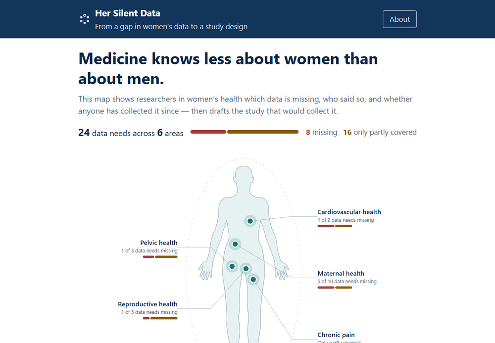
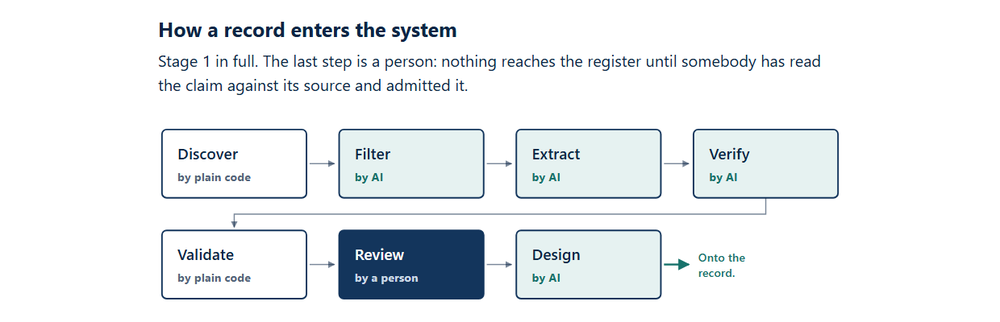

# Her Silent Data

**From a gap in women's data to a study design.**

[**Open the app**](https://minimarina.github.io/her-silent-data/) ·
[**Watch the demo (3 min)**](https://youtu.be/Y7JkdvYGjSo) ·
[**How it works**](https://minimarina.github.io/her-silent-data/#/about)

A platform for researchers who want to help close the data gap on women,
but don't know which data to collect first. The name is the subject: data
that exists in women's lives and was never recorded, so medicine cannot
hear it.

## What a record answers

1. **What problem do women face?**
2. **What data is needed to solve it?**
3. **Has that data already been collected?**
4. **Has anyone collected it since the gap was named?**
5. **If not: which women should it come from, what should be found out
   from them, and in what form?**

Most projects on this subject stop at "there is a gap." This one cites who
named the gap, searches the live web to see whether it has been closed
since, and — on request — drafts the study that would close it.

## The rule the register rests on

**Nothing is invented and stored.** A record carries what its source said
and nothing more. Where a source itself specified how and from whom to
collect, that is recorded and cited; otherwise the field is `null`, which
is the normal case. The validator rejects a guidance block with no source,
so the rule is enforced in code rather than promised here.

**What the platform generates, it labels and keeps out of the register.**
Pressing *Show research design* reveals a possible study design — who to
recruit, what to measure, the breakdowns, the instrument — marked
*AI-generated study design — unverified* with the date. It is an answer,
not a finding: it lives in `research-designs.js`, never in `data.js`, and
deleting that file leaves the app fully working.

It says *Show* and not *Generate* because the design was generated during
the intake run, not when you click. The app is static and holds no API key
(`SPEC.md` §13), so a button promising generation would be the one place
the product overstated itself.

**A design can be carried out of the app.** *Copy this design* puts it on
the clipboard as plain text, together with the data need, the gap claim,
its source and date, and what the check found. The provenance travels with
it on purpose: a design pasted somewhere without the claim it answers is
orphaned model output, which is the thing this whole project exists not to
produce.

**Every record carries a check, and states its limit.** A gap claim is
dated, and a live web search records whether the data has been collected
since. Where the check finds partial coverage the card names the dataset
and says what it does not cover; where it finds the data in full, the
candidate is not a gap and is not merged at all. No search proves a
negative, so a `missing` record says on its face that this was a search of
published sources, not proof, and invites a correction from anyone who
knows of data it missed.

No record has status `collected`. A register of gaps that lists data which
exists is listing the wrong thing.

## How records arrive

`intake/` holds the pipeline: discover, filter, extract, verify, validate,
review — and then, only for records a person has approved and merged,
design. Drafting a study for a candidate nobody admitted was money spent on
an answer to a record that did not exist, so the design step is behind the
human decision and refuses any id that is not already in `data.js`.

Discovery is plain code and costs nothing. Filtering is a yes/no read of an
abstract, so it runs on the cheapest model that can do it; extraction, the
check and the design run on a stronger one. Validation runs no model at
all. The one step that is not automated is the one that decides: nothing
reaches the register until a person has read the claim against its source
and admitted it.

It is not part of the app — `index.html` loads nothing from it — and the
app still opens from `file://` with no server and no dependencies. See
[`intake/README.md`](intake/README.md).

**Status:** the register holds **24 records across 6 areas** — 8 where the
data is missing, 16 where it is only partly covered — each with a dated
check, and 21 carrying a generated study design. Three designs were
withheld by the safety rules rather than repaired.

## Run it

Open `index.html` — double-click the file, or visit
<https://minimarina.github.io/her-silent-data/>.

There is no build step, no install and no server. Plain HTML, CSS and
JavaScript, no dependencies — four screens and one seed file do not need a
framework.

## Data

Every problem cites a published source, and every data need cites the
review or guideline that named the gap — systematic reviews, narrative
reviews and guidelines published within the last twelve months. Every
claim links to its source on the record itself; the rules every record
must satisfy are in `SPEC.md` §9.

**Every record has the same shape and arrived the same way.** Five
hand-sourced problems seeded this project and were removed on 18 Sep:
they predated the rule above, carried an unsourced specification, and
could not be brought into the current shape, so a reader would have seen
two generations of record. They are in the git history.

## Third-party assets

Two.

- **Female body silhouette** — OpenClipart #71126, dedicated to the public
  domain under CC0. <https://freesvg.org/female-body-silhouette>
- **The GitHub mark** in the footer — GitHub's trademark, used unaltered
  and in a single colour to link to GitHub, which is what their logo
  guidelines permit. Not covered by this repository's licence.

The silhouette's single `<path>` is pasted inline into `index.html` so the
app still opens from `file://` with no server and no network. The path
itself is unaltered; only its fill and stroke are set, from the palette in
`SPEC.md` §7.1.

Everything else — the layout, the markers, the ring, the data and all
the code — is original work.

## Licence

The code is MIT. The register — the selection, descriptions, verification
notes and generated designs — is CC BY 4.0. The **quoted sentences are
not ours to license**: each record reproduces one sentence from the paper
it cites, to report what that paper claimed, and those stay the copyright
of their publishers and authors. `intake/validate.mjs` rejects a
quotation longer than 300 characters. See `LICENSE`.

## Not medical advice

This is a research tool, written for researchers. Nothing in it is
medical advice, and the study designs are generated, unreviewed model
output.

## Accessibility

Built to the rules in `SPEC.md` §8.2: every status carries a colour, a
shape and a word, so it survives greyscale; the whole flow is keyboard
reachable with a visible focus ring; body text starts at 16px and steps
to 18px above 820px and 20px above 1180px, with captions at 14px and
field labels at 13px, every one measured at 4.5:1 contrast or better
against its own background; no horizontal scroll at 360px;
`prefers-reduced-motion` is honoured.

The type scale is on `:root`, so it also follows the reader's own browser
font-size setting rather than overriding it.

## Hackathon

Built for the Elevate Women Global Hackathon 2026.
All work in this repository was done during the Hackathon Period
(Sep 14–20, 2026). No pre-existing code is used. Development was
AI-assisted throughout, using Claude Code; the intake run calls Claude
Haiku 4.5 and Claude Sonnet 5. The published site itself calls no model.
